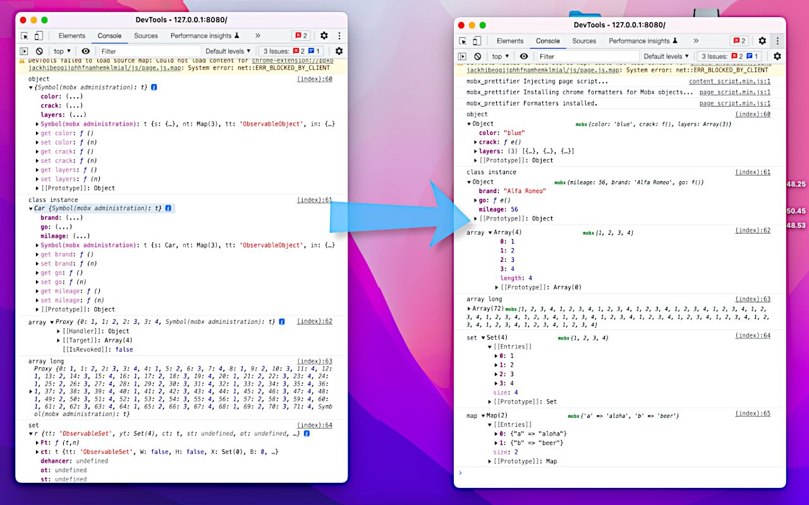

# Mobx Prettier
Mobx Prettier is a Chrome extension that prettifies / formats Mobx objects in Dev Tools console and debugger for easy inspection.




## Setup
```bash
npm i
```

## Develop
```bash
# Start up the example
npm run example
# Build the extension
npm run build

# Load the extension via chrome devtools: Chrome > Extensions > Load unpacked
# Test the extension on the example
```

Read about [developing extensions](https://developer.chrome.com/docs/extensions/mv3/getstarted/).

## Publish
```bash
npm run pack
```

Read about [publishing extensions](https://developer.chrome.com/docs/webstore/publish/).

## Inspiration
*There is no official documentation for writing chrome formatters and that just sucks immensely.*

- [chrome formatters blog post #1](https://www.mattzeunert.com/2016/02/19/custom-chrome-devtools-object-formatters.html)
- [chrome formatters blog post #2](https://docs.google.com/document/d/18GbcfQ4ddHgwbUzQgALQ6o8VFxtS9eJUD-xl9EjfxOU/edit#)
- [example #1 - mobx formatter, not very good](https://github.com/kubk/mobx-log)
- [example #2 - immutable.js formatter](https://github.com/andrewdavey/immutable-devtools/blob/master/src/createFormatters.js)


## Author's notes:

1. *I am not making any improvements to this extension until Google releases documentation for Chrome Dev Tool Formatters, now it's just a black box.*
2. Chrome Dev Tool Formatters get install to window. However, chrome extensions do not have access to window, so this part is a bit tricky. Here's how to do it 
